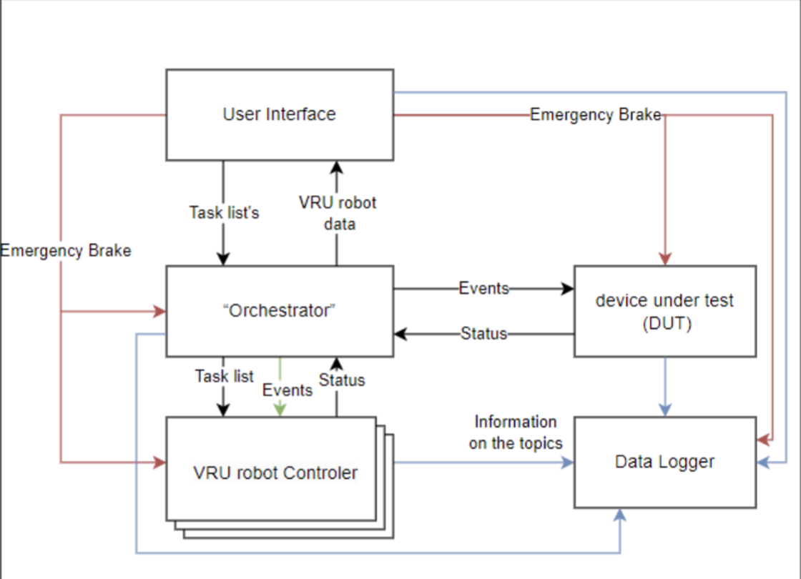
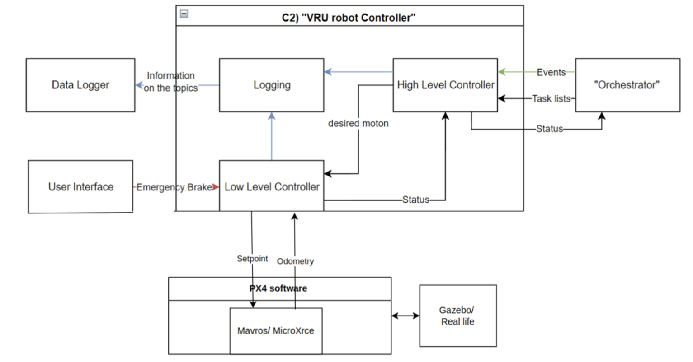
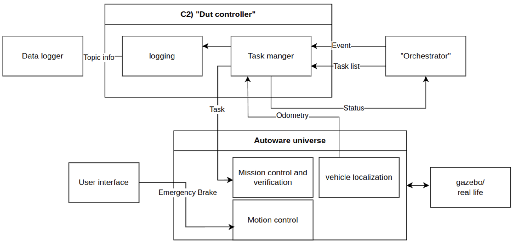
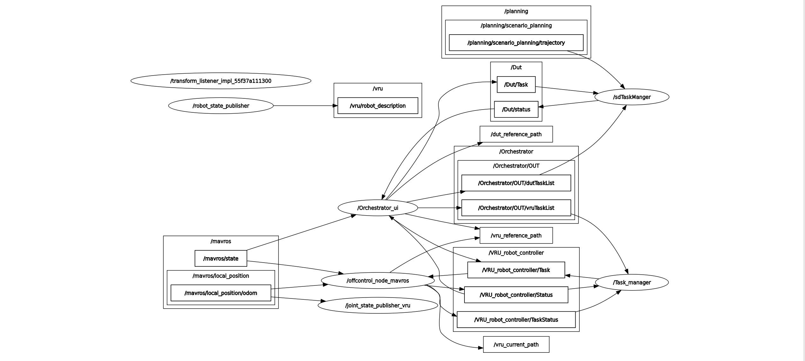

# Overview

The **VRU robot-based testing system** uses ROS2 as its middleware. The goal is to be able to plan and reproduce hazardous situations for testing the safety features of autonomous drive vehicles. 

## Architecture 

The overall flowchart of the current system is described below.

<p align="center">
  
</p>

<p align="center">
  
</p>

<p align="center">
  
</p>
The rqt_graph is shown below.

<p align="center">
  
</p>

Notice that because of the time constraint in the project SafeCLAI. Not all the nodes are connected exactly as designed some direct connections may be used to shorten the development time. 
## Features

This system includes the following features:

- **Plan and Reproduce** The system can plan a path for each actor in the scene, and define its starting event based on some criteria such as time, actor position, etc. In addition, the system also allows users to save the configuration to a file and read it for easier reproduction.
- **Stop all the actors** The system can (automatically) stop all the actors when the scenario is not going as planned.
- **Check the Time to collision**  tbd.

## Setting up the project
Use this document when possible, as it is a more complete manual: https://hannl.sharepoint.com/:w:/r/teams/VRUproject/Gedeelde%20documenten/HAN_POD/Software%20Part/software_manual.docx?d=w9fa4175128b94655b7116e8515dda5b9&csf=1&web=1&e=WF4Xxj

### installing mavros
mavros is a package which acts as an intermidiary layer between the ros2 network and the pixhawk network. This needs to be installed. More detailed information can be found here: https://docs.px4.io/main/en/ros/mavros_installation.html

*BEWARE THE DOCUMENTATION ON THIS ASSUMES THAT WE USE AN OLDER VERSION OF ROS2.
So if possible just follow the commands bellow.*

These are the commands that you need to run in this order in the terminal install it:
```sh
git clone https://github.com/PX4/PX4-Autopilot.git --recursive
```

```sh
bash ./PX4-Autopilot/Tools/setup/ubuntu.sh
```

```sh
sudo apt-get install protobuf-compiler libeigen3-dev libopencv-dev -y
```

```sh
sudo apt-get install ros-humble-mavros ros-humble-mavros-extras ros-humble-mavros-msgs
```

```sh
wget https://raw.githubusercontent.com/mavlink/mavros/master/mavros/scripts/install_geographiclib_datasets.sh
sudo bash ./install_geographiclib_datasets.sh
```


### installing px4 sim
More information about this can be found here: https://docs.px4.io/main/en/sim_gazebo_classic/

These are the commands that you need to run in this order in the terminal install it:
```sh
cd /path/to/PX4-Autopilot
make px4_sitl gazebo-classic
```

### Note
You need to edit a variable in the sdf file of the robot model to get it to work properly (this is hopefully fixed at the end of our iteration):

Go to this directory: 
```
/PX4-Autopilot/Tools/simulation/gazebo-classic/sitl_gazebo-classic/models/r1_rover
```

edit the r1_rover.sdf file to set ```<enable_lockstep>false</enable_lockstep>``` to false

## Compilations
Compilation is quite simple just run the following command in the project directory:
```sh
colcon build
```

## Launch

### Physical

To start the system physically the following needs to be done:

**Network** The computer and the jetson both need to be on the same network for this to work. 
It WILL NOT WORK ON THE SCHOOL WIFI. I recommend using a hotspot from a phone. There are some weird issues with running a hotspot on ubuntu, such as random disconnections, so i don't recommend using ubuntu to start a hotspot.

**On the Jetson** you need to start the low and high level controllers along with mavros (a translation layer for px4 to ros2).
To start mavros: (note: the usb is not always ACM0, it can change to AMC1 or something else, look at the software manual for more info.)
```sh
ros2 run mavros mavros_node --ros-args --param fcu_url:=serial:///dev/ttyACM0:57600  -r tf:=/px4/tf  -r tf_static:=/px4/tf_static 
```
To start the low and high level controllers:
```sh
ros2 launch basic_mobile_robot vru_offboard.launch.py
```

**On the remote computer** you need to start the rest of the program, which is the GUI and orchestrator.
To start them, simply run the launch file:
```sh
ros2 launch basic_mobile_robot orchestrator.launch.py 
```

### Simulation

The **VRU robot-based testing system**  starts with the following command.

Start the gazebo simulation. Run the following command in the PX4-Autopilot directory:
```sh
make px4_sitl gazebo-classic_r1_rover
```

Run the mavros in the project directory:
```sh
ros2 run mavros mavros_node --ros-args --param fcu_url:=udp://:14540@ -r tf:=/px4/tf  -r tf_static:=/px4/tf_static 
```

Launch the vru system. NOTE check if the source directories are correct.
```sh  
source ~/autoware/install/setup.bash
source ~/ros2_vru_system/install/setup.bash 
ros2 launch basic_mobile_robot vru_system.launch.py
```
